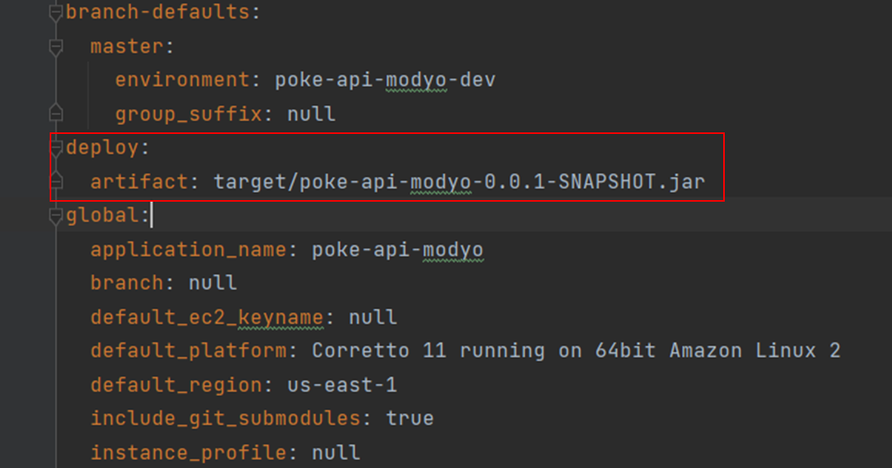
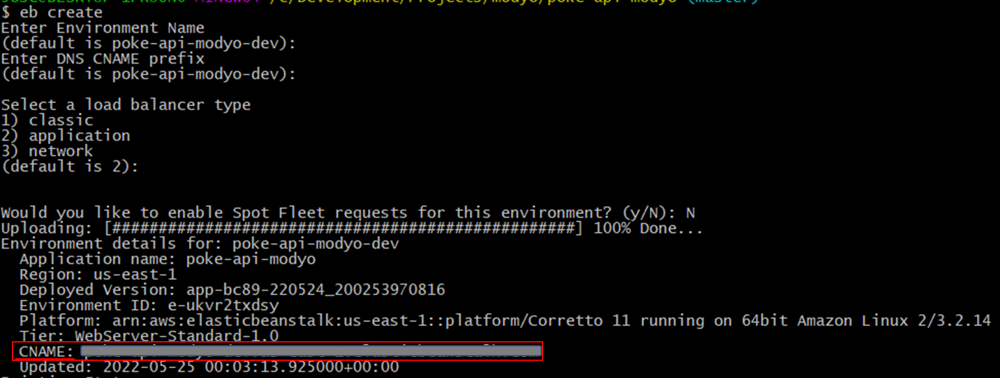

# AWS Deployment

## Pre-requisites:

* AWS account (better with admin permissions)
* Git (to clone this repo)

## Steps:

1) Download and configure AWS CLI

    https://docs.aws.amazon.com/cli/latest/userguide/getting-started-install.html

    https://docs.aws.amazon.com/cli/latest/userguide/getting-started-quickstart.html


2) Install EB CLI

   https://docs.aws.amazon.com/elasticbeanstalk/latest/dg/eb-cli3-install.html


3) Clone this repo 

`git clone https://github.com/joseg19/poke-api-modyo.git`


5) In cloned repo root path:

   `eb init`

   * Select your preferred region -> 
   * Select name ->
   * Select programing language -> (6) for Java
   * Select java version -> (1) for Java 11
   * CodeCommit -> n
   * SSH for instance? -> n


5) At the end of the .elasticbeanstalk/config.yml file, add the following:


````
deploy:
  artifact: target/poke-api-modyo-0.0.1-SNAPSHOT.jar
````

   Like this:
   


    

6) In cloned repo root path:


  * Windows:


    `.\mvnw.cmd clean package`


  * Linux/Mac:


    `./mvnw clean package`


7) In cloned repo root path:


    `eb create`

    * Select environment name -> default
    * Select CNAME -> default
    * Select load balancer type -> default
    * Select enable Spot Fleet -> N
    * ENTER

    **NOTE:** Save CNAME for later

    Reference image:
    


8) In cloned repo root path:

    `eb setenv SERVER_PORT=5000`


9) Test with curl:


   Replace with CNAME saved previously

    `curl REPLACE_HERE_YOUR_AWS_EB_HOST:8080/pokemon/pikachu`


      

# RUN ON LOCAL

## Pre-requisites:

* Java 11 or higher


## Steps:

1) In cloned repo root path:


  * Windows:


      `.\mvnw.cmd clean package`


  * Linux/Mac:


      `./mvnw clean package`


2) In cloned repo root path:


      `java -jar .\target\poke-api-modyo-0.0.1-SNAPSHOT.jar`
   
   
3) Test with curl:


      `curl localhost:8080/pokemon/pikachu` 

